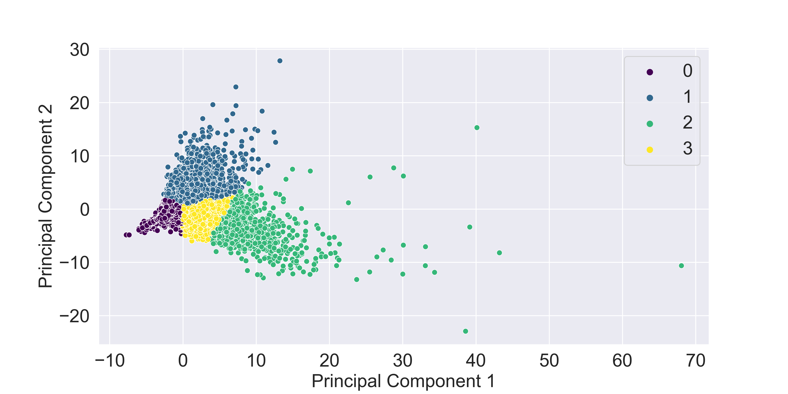
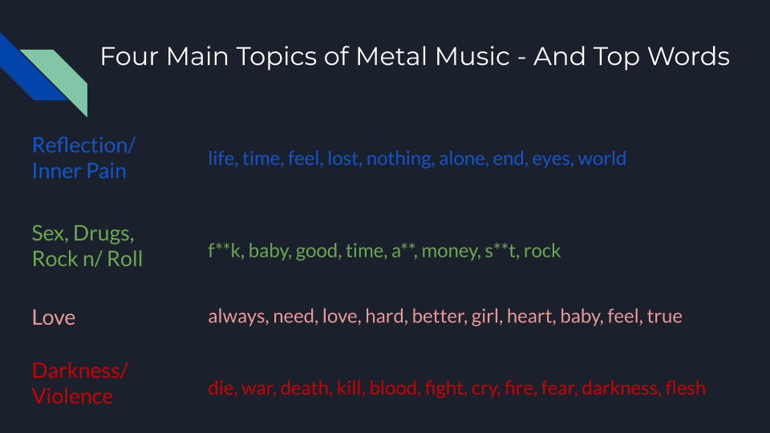
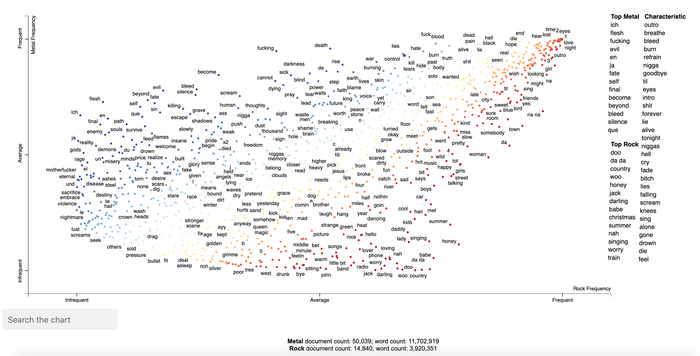

# The Essence of Metal Music

### A Deep Dive into Metal Lyrics Using NLP

**Summary:** in this project I analyzed the lyrics of ~50,000 metal songs with Natural Language Processing.  I performed text preprocessing, topic modeling with various methods, and dimensionality reduction with visualizations.  It turns out there are four overarching topics in the metal genre: reflection/inner pain, sex/drugs/rock n' roll, love, and (quite unique to metal music) darkness/violence.  The deliverables of this project were the slide deck/presentation, which you can find above; a [Tableau Dashboard](https://public.tableau.com/profile/drew.hibbard#!/vizhome/lyrics/ArtistDashboard) in which you can track topic distributions over time, as well as get lyrical stats on any metal artist; and a recommendation system based on Spotify's audio features such as loudness, energy, etc.  [Check it out here](https://lyric-nlp.herokuapp.com)

## Data

I used two data sources for this project:

1. [Spotify API](https://developer.spotify.com/documentation/web-api/)
    - names of top 1,000 metal artists and top 50 songs of each
    - characteristics such as popularity and followers
    - audio features of each song such as loudness, energy, and key
    
2. [Genius API](https://docs.genius.com/)
    - lyrics for each song

## Tools Used

- Python NLP libraries: nltk, spaCy, Scikit-learn, CorEx, pyLDAvis, scattertext
- Data Storage: MongoDB (json files obtained from Genius API)
- End Products: Streamlit, Tableau
    
## Text Preprocessing

In order for a machine to analyze the lyrics, they need to be in numerical format.  That involved a few step:

1. Stripping the text of special characters and numbers
2. Removal of common words present in all topics (stop words)
3. Lemmatization - eliminating suffixes to arrive at the root word
    - ex: run and running both end up as run
4. Vectorize to obtain a document-term matrix or TFIDF

## Initial Visualization

Before going to far, I wanted to know what level of separation the data could give.  So I performed Principal Component Analysis and K Means Clustering (with k=4, the optimal based on the elbow method), and plotted just the first two principal components.

Based on this, I moved ahead with further topic modeling and visualizations.

## Topic Modeling

As a beginner to NLP, I decided to try many of the topic modeling methods.  I did Latent Semantic Analysis (LSA), Non-Negative Matrix Factorization (NMF), Latent Dirichlet Allocation (LDA) and CorEx.  All led to the same four overarching topics, with CorEx and NMF resulting in perhaps the most separable top words.

## Further Visual Analysis

There were numerous ways to visualize the lyrics.  One of my favorite was the Scattertext plot, showing the frequency of various words used in metal versus rock.  We can see that metal has a darker side, whereas rock is more focused on having a good time.

The last visual I have it a [Tableau Dashboard](https://public.tableau.com/profile/drew.hibbard#!/vizhome/lyrics/ArtistDashboard).  The first tab tracks changes in the topic distributions over time, and lists the top artists focused predominantly on each category.  

I also performed VADER Sentiment Analysis to test my suspicion that metal music is overwhelmingly negative lyrically. This gives each song a score from -1 (very negative) to +1 (very positive) in terms of word use.  The average score across all 50,000 metal songs was -0.15, which confirmed my suspicions.  

## Recommendation System

The last piece of this project has nothing to do with lyrics or NLP.  It is a metal music recommendation system that uses Spotify's "audio features" of each song to calculate the "distance" (similarity) between songs and provide recommendations based on these similarities.  I made a Streamlit web app that can be tested [here](https://lyric-nlp.herokuapp.com).